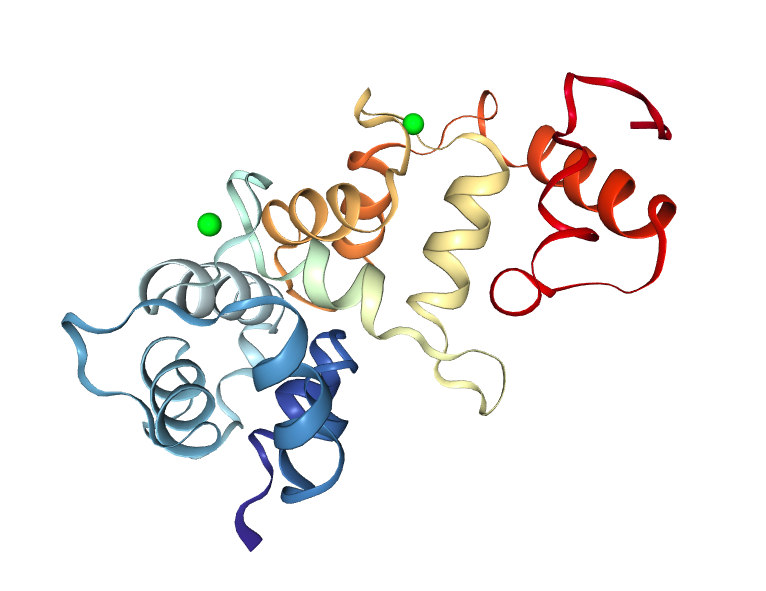

# Folder organization

We keep the "good" metadynamics runs (in `wt_mdyn`, where `wt` stands for "well-tempered") separated from the non-biased runs (which are reported in `tpr_generation`).

Inside `tpr_generation`, the four analyzed systems
- non-myristoylated Recoverin (`nmRec`)
- non-myristoylated Recoverin in complex with GRK1 (`nmRec_GRK1`)
- Recoverin in membrane (`membr_Rec`)
- Recoverin with GRK1 in membrane (`membr_Rec_GRK1`)
were simulated for 10 ns to recover the typical standard deviation of the distance and obtain a more relaxed structure to use in the metadynamics runs. The process of building up of the `.tpr` files from the `.gro` structures could be painful, so we keep it separated in the four subfolders 
- `nmRec`
- `nmRec_GRK1`
- `membr_nmRec`
- `membr_nmRec_GRK1`
Each folder contains the files for the setup of the systems starting from the given structure files labeled with the suffix `_start.gro`. 

*The non-myristoylated protein with the calcium ions in EF2 and EF3.*

The folder `wt_mdyn` contains four well-tempered metadynamics simulations with a single walker and other four multiple walkers simulations (reported in `Walk_MPI`). 

The set of benchmarks for both CPUs and GPUs is in `benchmarks`.

The "trial & errors" session is placed in `explorative_meta`. In this folder we explore different variations of well-tempered metadynamics. 

After a first trials & errors session with plumed, I decided to do a simple well-tempered metadynamics. 
Reasons: 
1. Geometrically adapted metadynamics 
2. Frequency adapted metadynamics 
3. Parallel bias metadynamics 
All these variations are implemented in plumed but I didn't see any research article applying these methods to physically relevant systems (only alanine dipeptide was treated). 

On the other hand, I found articles relying on the multiple walkers version of metadynamics. 

