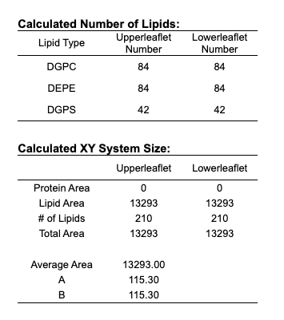

# Create a larger box 

The idea is the following:
1. Build a membrane system with charmm-gui (only the membrane!)
2. Try to merge the protein-membrane systems using `-membed` in `mdrun`

# Point 1: build the membrane
Choose `Membrane builder` and then `bylayer builder` on charmm-gui. 
- I selected 115 (I think it's in Angstrom) as the initial guess lenght of X and Y. Then I took the lipids with a ratio 4:4:2

- I added K and Cl ions with 150 mM
- One problem with charmm-gui is that apparently it only generates water boxes that are symmetrical w.r.t. the membrane. To solve this problem, we need to eliminate the water, redefine a box and solvate again using gromacs. 

# Point 2: embed the protein
The basic idea is to slowly grow the protein into an already equili- brated membrane, thereby pushing away the lipids and waters and fit the protein nicely into the lipid bilayer.

How does `-membed` work?
1. Protein narrowing: the coordinates of the atoms in the protein are scaled with respect to the geometrical center of the transmembrane part of the protein by a user specified scaling factor of the original (input) coordinates in the xy-plane and, if applicable, in the z-direction. 
2. Remove overlapping molecules: every molecule not part of the protein for which at least one atom is within a user defined radius of a protein atom will be removed. 
3. Growth phase: the protein size is increased until it reaches again the initial size. 

The protein should be placed at the desired position and orientation overlapping the lipid bilayer by using for instance pymol. 