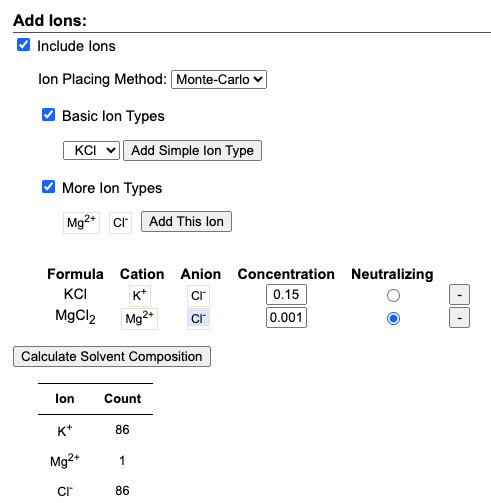

# We must create a larger box

We take the more equilibrated structure of the last frame (always labeled with capital letters) of the unbiased run. We make an index file with the protein and calcium ion
```
gmx make_ndx -f NMREC.gro -o index.ndx 
```
Next, we create a pdb containing only the protein and the calcium ions: 
```
gmx trjconv -f NMREC.gro -n index.ndx -s md_meta.tpr -o nmRec.pdb
```
Then change the name of the chain of calcium and modify its name to `CA` (because that's the nomenclature for sdf files in rcsb). 


*Screenshot of CHARMM-GUI*
