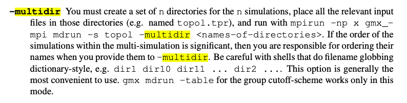

# Multiple walkers metadynamics
It speeds up metadynamics calculations by orders of magnitude and renders the algorithm much more robust. In this method, several walkers are allowed to explore the same FES. 

Do we need a single simulation or more than one? We need multiple concurrent simulations. 

How do we set the pace of deposition in case of multiple walkers? Namely, how do we tell the walker 1 to add its Gaussian after walker 0? We don't have to tell the walker this information. The walker is only aware of the bias potential $V(s, t)$. 

## Central concept
Imagine $N_w$ metadynamics simulations, each with its associated walker, that simultaneously fill the same free energy well. $V(s, t)$ is given by the sum of the Gaussians laid by all the walkers that otherwise do not interact.

Each run is completely independent of the others but for the common file containing the positions of all the added Gaussians. The file is periodically read from each walker and the position of the new Gaussian appended to it. Because the file is accessed asynchronously and independently by each walker, the dynamics can be run on machines of different speeds and a walker can be started or stopped without interfering with the simulation

The level of required communication between the walkers is very low. Why? Because we only need to read the shared `HILLS` file.

1. We need a plumed input file for each walker.
2. We need a shared directory in which all the `HILLS` files are collected. The reason why there are several HILLS files is that this is the only way to avoid races in writing a single `HILLS` file. 
3. If you use the `WALKERS_MPI` option with 4 simulations, you will obtain 4 `COLVAR` files and only one `HILLS`. It is enough to read and write hills file from the same folder using `FILE=HILLS`. 

Keywords we need to specify:
- `WALKERS_ID`: to identify the walker (starting from 0 )
- `WALKERS_N`: the number of walkers
- `WALKERS_DIR`: shared directory with the hills files from all the walkers
- `WALKERS_RSTRIDE`: stride for reading hills files
- `WALKERS_MPI`: switch on MPI version of multiple walkers - not compatible with `WALKERS_*` options other than `WALKERS_DIR`. `METAD` with `WALKERS_MPI` now writes a single hills file, without suffixes.

# Observations 
- An upper limit to the number of walkers is imposed by the intrinsic diffusivity properties of the system.
- If the FES is not known a priori, the walkers have to be initialized, in the worst case scenario in the same position. 
- The error on the reconstructed free energy does not depend on the number of walkers. 
- The directory in which you state where the HILLS file (files in case of PBMetaD) is in the plumed input depends on whether you are employing communication between walkers using the file system or whether you are doing this with MPI. 
- You will obviously need one directory in your working directory for each walker, named as per your gmx mdrun command. All necessary files (`.tpr` files, plumed inputs and `.ndx` files) need to be in the walker directories.

We can select 4 initial configurations, and then run a multiple walker simulation on each of them. Can we apply a different $\sigma$ and different $\tau$ of deposition on each walker?


If I have 4 simulations, I will reach a different final `state.cpt` configuration in all the cases, but this does not matter, because the aim of the method is to obtain the free energy profile as $-V(s, t)$. 


# How should I call gromacs in a `.pbs` file ? 
```
mpirun -np 12 gmx_mpi mdrun --plumed walkers.dat -multidir WALKER0 WALKER1 WALKER2 WALKER3
```
With the `-multidir` option, gromacs is able to share the bias across the simulations. 



# Other possible CVs
One idea is to take a biased run, do a reweight, and see whether the fluctuations of the $R_g$ are significant. For example, we can compute this new possible CV in the run of the folder `freq_adapt`.
Ok, it seems that the $R_g$ pretty much stays the same along both the biased and unbiased simulation. 

In any case I think there is some kind of problem with `comp_traj.xtc`: I can adjust the sampling frequency with `DUMPATOMS`, maybe `STRIDE=10` should be enough.

# Import 
```
scp giuseppe.gambini@hpc2.unitn.it:/home/giuseppe.gambini/simulations/explorative_meta/Walkers_MPI/WALKER3/COLVAR.3 ./
```

In case you want to use plumed on cluster, just do
```
module load gcc91
module load openmpi-3.0.0
module load BLAS
module load gsl-2.5
module load lapack-3.7.0
module load python-3.8.13 
source /home/giuseppe.gambini/usr/src/gmx_plumed.sh
```