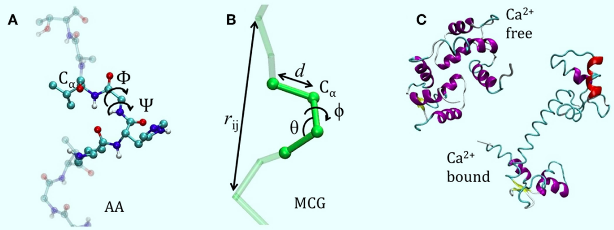

# Structural transition studied with coarse-grained model 

We can apply a minimalist coarse-grained model to the Recoverin based on an empirical force field with a partial structural bias. The endpoints of our trajectories will be the tense T (the myristoyl is inside a pocket) state and the relaxed R state (where the $\text{Ca}^{2+}$ ions are inside the pocket and the myristoyl group exits the protein). 

## Minimalist CG model 
We only represent the $\alpha$-C, so we only have one bead (interacting center) for amino acid. 

In one-bead (and even two beads) CG models for proteins, the two conformational dihedrals $\phi$ and $\psi$ around the two bonds $\text{C}\alpha-\text{N}$ and $\text{C}\alpha-\text{C}$ are no longer present as explicit internal coordinates. 

This one-bead choice allows uniquely representing the secondary structure by the internal variables $\alpha, \theta$. These are, respectively,the dihedral and the angle between consecutive $\text{C}\alpha$. 

There exists an analytical correspondence of the all-atom internal backbone coordinates $(\phi, \psi)$ to the CG internal backbone coordinates $(\alpha, \theta)$ that allows one to explicitly map the Ramachandran plot onto a new $(\alpha, \theta)$ conformational density plot. 

Interestingly, due to the rigidity of the peptide bond, the distance between two subsequent $\text{C}\alpha$’s has less than 1% variation.

Note that as an effect of the extreme coarse graining, the non-bonded interactions are highly specific and anisotropic at short distances. 

## How is the FF determined? 
The minimalist CG models may have from 10 to 100 parameters, including both the "structural parameters" (equilibrium values of the coordinates) and the "energetic parameters" (elastic constants, bonding energies, well depths, barriers, etc...). 
How can we fix structural parameters by biasing them toward a reference (usually experimental) structure? We take a force field of the form

$$U=\sum_i U_{bond}(r_i, r_{i+1})+\sum_i U_{back}(\alpha_i, \theta_i)+\sum_{i<j}U_{nb}^{loc}(r_{ij})+\sum_{i<j}U_{nb}^{non loc}(r_{ij})$$

where the separation into local and non-local parts is generally based on a cutoff radius $r_{cut}$. If you consider a simple elastic model, the $U_{nb}^{nonloc}$ part is absent as well as $U_{back}$. In this case the $U_{bond}$ is clearly an harmonic potential and U_{nb}^{loc} contains the interactions between second and third neighbours (1–3 and 1–4 interactions). 

Once the form of the FF is given , we can get the structural and energetic parameters using three main methods:
- iterative Boltzmann inversion
- force matching
- relative entropy

All these methods are fitting procedures for obtaining optimal parameters. At the very end, the coarse-graining problem is an optimization problem.

## Double force field 
Since we have two reference structures, we can define two different coarse-grained force fields $\text{FF}_A$ and $\text{FF}_B$. 

How do the two FF differ? As illustrated in the article about HIV protease, we can use the iterative Boltzmann inversion to obtain the analytical bond angle term $E_{\theta}$. We can for example collect data from an ensemble of structures, obtain a distribution of the angle $P(\theta)$ and then get the PMF as

$$U(\theta)=-kT\log{P(\theta)}$$

More in general, suppose that the total internal energy of the system can be exactly decomposed as the sum of uncorrelated terms, each depending on a single internal CG variable:

$$U(\{Q_I\})=\sum_I U_I(Q_I)$$

where $U_I$ can be $U_{bond}, U_{back}...$ and $Q_I$ could be $r_{ij}, \theta...$, the PDF of a single one of these $(\{Q_I\}$ variables is given by 

$$P(Q_I)\propto \int dQ_1...dQ_{I-1}dQ_{I+1}...dQ_{N} \ \exp{(-\beta U(\{Q_I\})/kT)}=\exp{(-\beta U(Q_I)/kT)}$$

where the second equality stands if the condition of complete un-correlation between the FF terms is valid. 

We could also use a Go model, which is usually more strongly biased toward a reference structure. In fact, Go models are aimed at describing folding, thus, the FF are not flexible enough to explore properly non-native configurations and reproduce more general dynamics.

## How the AA strucures are rebuilt?
In the article they use a tool named `Pulchra` and then they explicitly hydrated using `OPLSe` force field.

