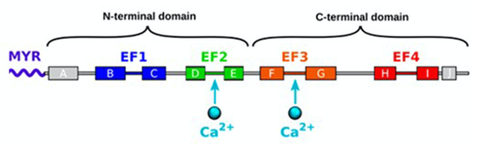

# Structural information

Recoverin (Rec) is a low molecular-weight (approximately 23 kDa), neuronal calcium sensor (NCS). The $\text{Ca}^{2+}$-bound Rec has been proposed to inhibit G-protein-coupled receptor kinase (GRK1) in darkness.  

It contains four EF hand motifs and a myristoyl group at the N-terminus. Only the EF2 and EF3 hands bind $\text{Ca}^{2+}$.

In absence of $\text{Ca}^{2+}$, the myristoyl is hidden inside an hydrophobic pocket in the N-terminal domain. 

The binding of two $\text{Ca}^{2+}$ ions leads to the extrusion of the myristoyl group. This extrusion allows the binding of Rec to the phospholipid membrane. 

*A picture of the structure of Rec*

Little is known about how the insertion of the myristoyl moiety affects the lipid membrane. Although the insertion does not seem to disturb membrane integrity, it greatly impacts the electrochemical properties of the bilayer. Both the surface charge density and the surface pressure of membranes are reduced upon Rcv binding, supporting the importance of electrostatic interactions.

Calcium binding occurs via a sequential, non-cooperative mechanism in non-myristoylated Rec (nmRec) with moderate to high affinity for the specific binding sites ($K^D_{EF2}$ = 6.9 $\mu\text{M}$; $K^D_{EF3}$ = 0.11 $\mu\text{M}$). By contrast, the $\text{Ca}^{2+}$ binding to myristoylated recoverin (mRec) is highly cooperative and has been successfully described by a concerted allosteric model in which multiple equilibria exist between R and T states, each conformation being possibly populated at different occupation levels of the $\text{Ca}^{2+}$ binding sites.

The myristoyl group is thought to act as an allosteric inhibitor that keeps mRec in the T state in aqueous solution and decreases its apparent affinity for $\text{Ca}^{2+}$. In opposition, nmRec exists predominantly in the R state and the sequential, non-cooperative binding reflects the intrinsic affinities of the two EF-hands for $\text{Ca}^{2+}$ ions. 