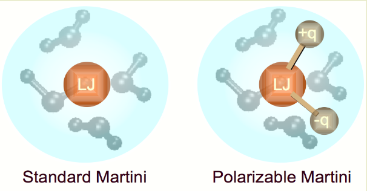

# Tutorial MARTINI

We follow the tutorial reported at http://www.cgmartini.nl/index.php/2021-martini-online-workshop/tutorials/564-2-proteins-basic-and-martinize-2. 

In this tutorial we will see how to set up a coarse-grained protein simulation. 

In the downloaded folder `tutorial_2` we can find the subfolder `template`. We can use the subfolders `*_worked` to check the work. 

# First part of the tutorial 
We get the atomistic structure of L99A T4 lysozyme, contained in `181L.pdb`. As first thing we have to remove water and other molecules usually used for crystallization

```
grep "^ATOM" 181L.pdb > 181L_clean.pdb
```
This clean structure can be used as input the code `martinize2.py`. Before proceeding, we have to install this tool from GitHub. We must provide infomation about the secondary structure 

```
martinize2 -f 181L_clean.pdb -o t4l_only.top -x t4l_cg.pdb -ss CCHHHHHHHHHCCEEEEEECTTSCEEEETTEEEESSSCHHHHHHHHHHHHTSCCTTBCCH HHHHHHHHHHHHHHHHHHHHCTTTHHHHHHSCHHHHHHHHHHHHHHHHHHHHTCHH HHHHHHTTCHHHHHHHHHSSHHHHHSHHHHHHHHHHHHHSSSGGGC -p backbone -ff martini3001
```

- `H`: $\alpha$-helix
- `B`: residue in isolated $\beta$-bridge
- `E`: extended strand, participates in $\beta$-ladder
- `G`: 3-10 helix
- `I`: 5 helix ($\pi$-helix)
- `T`: hydrogen bond turn
- `S`: bend
- `C`: loop or irregular

With the above command, we generated 3 files:
- a coarse-grained structure (`.pdb`)
- a master topology file (`.top`)
- a protein topology file (`.itp`)

To run a simulation we need two additional files, namely:
- the Martini topology file, `martini_v3.0.0.itp`
- a run parameter file (`.mdp`)

## Setting up the first minimization
You want to make sure, the box dimensions are large enough to avoid close contacts between periodic images of the protein, but also to be considerably larger than twice the cut-off distance used in simulations.

```
gmx editconf -f t4l_cg.pdb -d 1.0 -bt dodecahedron -o t4l_cg.gro
```
In the `minimization.mdp` file we leave 10 kJ/mol (the default value for `emtol` in gromacs). Remember to correct the `t4l_only.top` with the name of the `martini.itp` you are using. 

```
gmx grompp -p t4l_only.top -f minimization.mdp -c t4l_cg.gro -o minimization-vac.tpr -r t4l_cg.gro
```

## Solvate the system
Gromacs needs to know the van der Waals radii of each atom, namely, the radius of an imaginary hard sphere representing the distance of closest approach for another atom. Think at the van der Waals equation of state: there you have terms accounting for the efective volume occupied by the atoms. For instance, the $r_{\text{vdw}}$ of Carbon is 0.17 nm. Since we are introducing new atoms with respect to the ones listed in the default file `vdwradii.dat`, we have to specify a global vdw radius. 
```
gmx solvate -cp minimization-vac.gro -cs water.gro -radius 0.21 -o solvated.gro
```
The `-vac` specification stands for "vacuum".
The option `-cs` specifies the solvent. More specifically, `solvate` assumes you are passing a box of pre-equilibrated solvent. This is given in the `water.gro` file. If you think about it, this operation is not strange, since the usual `spc216.gro` is actually a pre-equilibrated structure containing water molecules. Most probably, gromacs deduces a RDF and an average bulk density from this file and replicates them in the actual box containing the protein. 


Each Martini water bead represents 4 water molecules



*The polarizable Martini is composed of three-bead model to represent four water molecules. This has the consequence that the dielectric screening of bulk water is reproduced.*


What is the aim of the two files `.itp` for solvent and ions? 

The tool `genion` will work for Martini systems (any system actually) if you precise the amount of ions you want with the `-np` (number of positive ions) or `-nn` (number of negative ions) flags or by specifying the concentration with `-conc`, which overrides the `-np` and `-nn` options. 

Remember that one coarse-grain water bead = four water molecules, and one coarse-grain ion bead = one ion solvated by four water molecules. 

We create a new topology called `system.top` from the `t4l_only.top` in which water and ions will be included. After this, we produce the `ions.tpr` and then run `genion`. 
```
gmx grompp -f minimization.mdp -c solvated.gro -p system.top -o ions.tpr
```
```
gmx genion -s ions.tpr -o solv_ions.gro -p system.top -pname NA -nname CL -conc 0.15 -neutral
```
Gromacs will try to add 27 NA ions and 35 CL ions. The topology is automatically updated.

## Second minimization
The only difference is that here we do not have the protein in vacuum anymore, but the whole system. 
```
gmx grompp -p system.top -c solv_ions.gro -f minimization.mdp -o minimization.tpr -r solv_ions.gro
```

## Equilibration and dynamic run
Remember that when using position restraints, a file with restraint coordinates must be supplied with `-r` (can be the same file as supplied for `-c`).
```
gmx grompp -p system.top -c minimization.gro -f equilibration.mdp -o equilibration.tpr -r minimization.gro
```

```
gmx grompp -p system.top -c equilibration.gro -f dynamic.mdp -o dynamic.tpr
```

# Martini & Go models
A combination of Gō-like models with Martini was presented by Poma et al. 2017. 