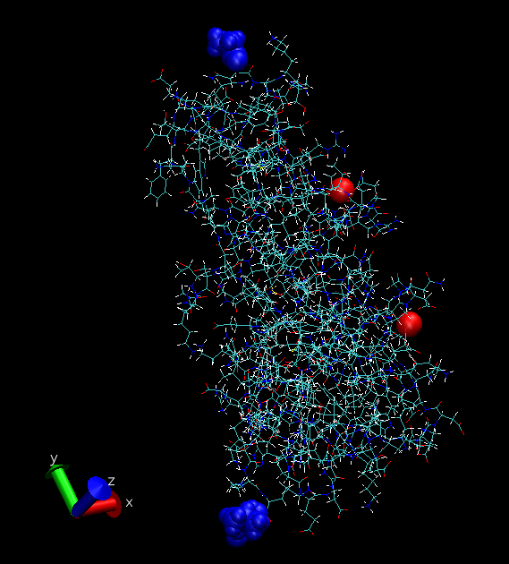

# Simulations with the multisite Calcium ion

This is the plan: 
1. Charged termini for the nmRec simulation 
2. Neutral termini for the simulation of Rec with the myristoyl and the membrane. 

## Procedure for the nmRec
I started with the initial structure without water. Then I used pyMOL to obtain a pdb with specified chain IDs. 

Outline of the procedure with Charmm-gui: I feed the `nmRec_Ca.pdb` structure with both Calcium atoms named `CA` (not `CAL` as usual). Importantly, the protein is the chain A, while the two Calciums constitute the chain B. I select `CTER` and `GLYP` for the terminations. Then I impose a box of (10, 10, 10) with 0.15 M KCl concentration. After this, Charmm-gui asks me whether I want to use the multisite Calcium. I tick the box and proceed with generating the gromacs input. 

*The ions are sufficiently distant from the termini. Therefore, charged termini should only influence the behaviour of the ligands minimally.*