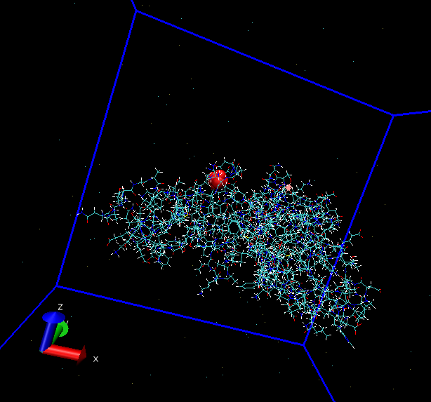

# Attempts of unbiased MD and VBmetaD with multisite calcium

The files and the parameters were generated with Charmm-gui. No merging of the ff was necessary since we decided to keep the charged N and C termini.

*The multisite calcium is represented in red*