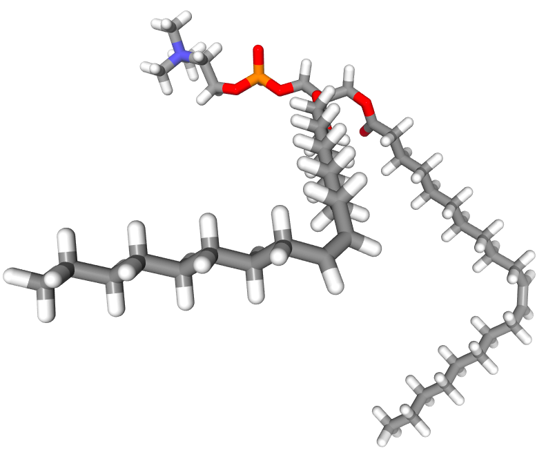
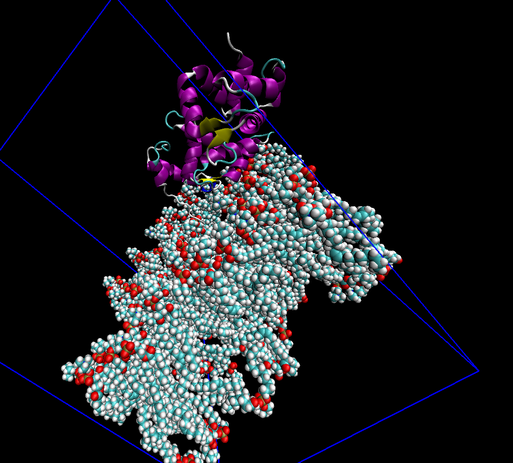

# Myristoylated Recoverin in membrane 

Gromacs can directly treat all the ions and solvent provided that a good force field for them is provided. 

The myristoyl group is a fatty acid connected to the recoverin through the GLY-N terminal. For the VMD visualization, the `resname` of such a group is `GLM`. 

The folder `glm` contains the force field with the parameters of the myristoylated glicine at the N-terminal. The `residuetypes.dat` contains the definition of `GLM` (N-myristoyl Gly) as a protein residue. 

When using `pdb2gmx` we need to use the option `-ter` for the "capping" of the N and C-terminals. This time we need to select `none` for the N-terminal. 


## Preliminary observations
- We first notice that we have approximately two times the number of atoms we had in the previous cases without membrane.
- This time we already have `POT` and `CLA`, so we don't have to change their names.
- The box is extended in one direction, as can be noted from the starting `.gro` file: `9.06166   9.06166  14.98092`. 

From the "molecule library" of charmm-gui, we can get the meaning of the misterious residues:
- `DGPC`: DI-GADOLEIC-PHOSPHATIDYLCHOLINE. 
- `DGPE`: DI-GADOLEIC-PHOSPHATIDYLETHANOLAMINE
- `DGPS`: DI-GADOLEIC-PHOSPHATIDYLSERINE. Together with the previous two species, we have 260 residues. These atoms represent the membrane!
- `GLM`: myristoylated glycine N-terminal



*A picture of DGPC*


*A picture of the system membrane + protein. Notice that part of the protein is outside the box.*


## Adding new residues to gromacs
We need to make the force field parameters "visible" to gromacs. 

1. The residue `GLM` is already added to the `merged.rtp` in the `.ff` folder
2. The `residuetypes.dat` is already updated with the appropriate specification

Modifying a force field is best done by making a full copy of the installed forcefield directory and `residuetypes.dat` into your local working directory, for instance:
```
cp -r $GMXLIB/residuetypes.dat $GMXLIB/amber99sb.ff .
```
Therefore, what we have to do is to simply put the `.ff` folder and the `.dat` file in the working folder.

## Problem regarding the CMAP torsions
We first tried a naive procedure and generated the topology with `pdb2gmx`. In this section we describe the error encountered:
```
gmx grompp -f mdp/em.mdp -c membr_Rec_ions_solv.gro -p topol.top -o em.tpr
```
Gromacs has a problem in understanding all the CMAP torsions. The error is: 
```
Unknown cmap torsion between atoms 3280 3282 3284 3299 3305
```
if you check the `cmap.itp` file below `[ cmap ]`, you will notice that this is actually the last combination. 

By definition, CMAP=torsional correction map. This term is defined in the rtp file by a `[ cmap ]` statement at the end of each residue supporting CMAP. We can check the file `cmap.itp`. 

- 3280: `C`, `201LYS`
- 3282: `NH1`, `202LEU`
- 3284: `CT1`, `202LEU`
- 3299: `CD`, `202LEU`
- 3305: `NTL`, `1DGPC`

This error is a result of asking `pdb2gmx` to process an heterogeneous environment. When `pdb2gmx` writes a CMAP entry for these atoms, it does not recognize the atoms belonging to the membrane.

One possible solution is to separate the components of the system (protein & lipids) for processing by `pdb2gmx`. In this fashion, we should get separate topology files without spurious bonded interactions (not just CMAP). 


# New procedure
We want to get two separate `topol.top` and then merge them together, as we did for the ligand case.  


Let's open the file `membr_Rec_start.gro` in pyMol. We select `Display->Sequence`. You can also change the representation of the residues by doing `Display->Sequence Mode->Residue Name`. After having done the selection of the residues of the lipid membrane 
```
select atoms, id 3305-41004
alter (atoms),chain="M"
```
we save the `.pdb` file with `Export Molecule` and `Retain Atom id`. We can then proceed with `pdb2gmx`. 

```
gmx pdb2gmx -f membr_Rec.pdb -o membr_Rec.gro -ter yes
```

## NVT equilibration 
We want to release progressively the restraints on the protein. 

Remember that applying restraints on something that is different from the protein is 

We can modify the `topol*.itp` file with the keywords `POSRES`, `IPOSRES` and `MPOSRES`.

In case you wanted to put small restraints, you can replace 1000 with `POSRES_PROT`, `POSRES_IONS`, `POSRES_MEMBR`, `POSRES_SOLV`.
```
sed -e 's/1000/POSRES_IONS/' -e 's/1000/POSRES_IONS/' -e 's/1000/POSRES_IONS/' posre_Ion2.itp > new_posre_Ion2.itp
```
```
sed -e 's/1000/POSRES_PROT/' -e 's/1000/POSRES_PROT/' -e 's/1000/POSRES_PROT/' posre_Protein.itp > new_posre_Protein.itp
```
```
sed -e 's/1000/POSRES_IONS/' -e 's/1000/POSRES_IONS/' -e 's/1000/POSRES_IONS/' posre_Ion3.itp > new_posre_Ion3.itp
```
```
sed -e 's/1000/POSRES_MEMBR/' -e 's/1000/POSRES_MEMBR/' -e 's/1000/POSRES_MEMBR/' posre_Other_chain_M.itp > new_posre_Other_chain_M.itp
```

Be careful: if the atom has index 1000, then you must correct that line. 

Now, you have to modify accordingly each topology file by telling gromacs to watch the new files. Moreover, you must also remember the restraint on the water molecules, directly in the principal `topol.top` file.

Now we can go on with 
```
gmx grompp -f mdp/nvt_1.mdp -c em.gro -r em.gro -p topol.top -o nvt_1.tpr
```
Remember to include the important line 
```
define = -DPOSRES  -DPOSRES_PROT=1000
```
in the `.mdp` file (why these start with `-D` is because it mimics the command line argument for the C preprocessor).

# Equilibration runs
1.  200 ps of NVT with 1000 kJ/mol as restraint on the heavy atoms of the protein 
2. 400 ps of NPT with 1000 kJ/mol
3. 400 ps of NPT with 500 kJ/mol

I think that 1 ns of equilibration could be enough. 

## Observations about the `.mdp` files in presence of a membrane
The most important parameter for pressure coupling in membrane is `pcoupltype = semiisotropic`. This means that the pressure coupling is not completely isotropic, rather we impose an uniform scaling of x-y box vectors, while the z component is independent. We deal with a squared membrane, so we don’t want to obtain a rectangular one at the end of our setup.

Remember that the internal pressure is maintained constant by allowing the volume of the simulation box to fluctuate. 

# Production run
```
gmx grompp -f mdp/md.mdp -c npt_2.gro -r npt_2.gro -p topol.top -o md.tpr
```

# Problem with the LINCS algorithm 
When MD works correctly only on one MPI task and crashes on multiple MPI ranks, it may indicate that your molecule isn't whole at the start of a simulation. You need to make the molecule whole again.

This problem was actually generated by the presence of restraints on the solvent!

Restraints could lead to wrong physics because, for instance, they might not allow the right electrostatics to be recovered. 

