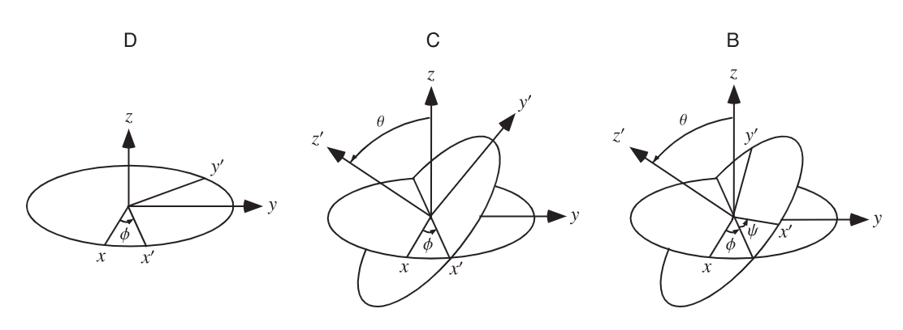

# Pilot metadynamics 

The aim is to start an aggressive metadynamics in order to generate 8 different configurations for the definitive MW metadynamics.  

I generate the `.tpr` in this folder using the ff and the topology files. 

```
module load gcc91
module load openmpi-3.0.0
module load BLAS
module load gsl-2.5
module load lapack-3.7.0
module load python-3.8.13 
source /home/giuseppe.gambini/usr/src/gmx_plumed.sh
```

# Obtaining eight starting configurations 
As suggested by Alessio, I can perform a cluster analysis with MDAnalysis to identify the 8 configurations. 

# Align the box of the fitted frames 
I don't want to alter the coordinates of the protein. I simply want to preserve the center of the box because the funnel is defined in global coordinates.



Let us call $a, b$ and $c$ the three vectors defining the unit cell. Then the gromacs wants the sequence $a_x, b_y, c_z, a_y, a_z, b_x, b_z, c_x, c_y$. 